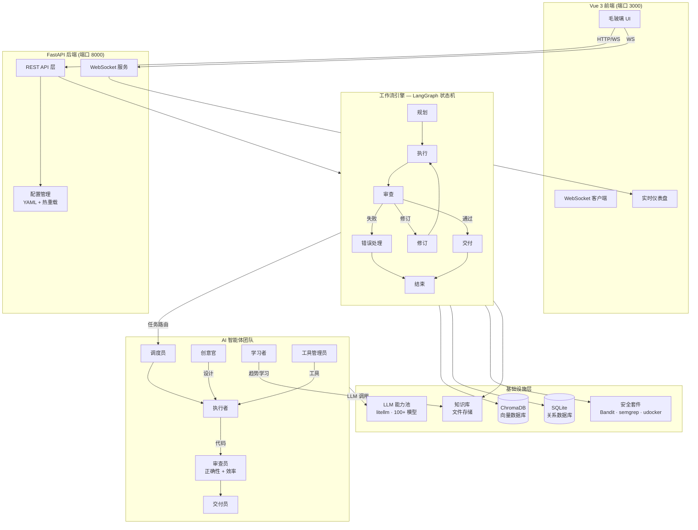
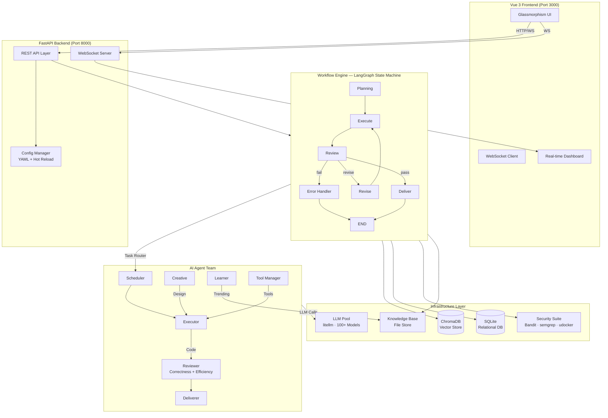

<p align="center">
  
  
  
  
  
  <br>
  
  
  
  
</p>

<h1 align="center">IReckon — Multi-Agent Autonomous Programming System</h1>
<p align="center"><em>I think it can work</em></p>

<p align="center">
  <a href="README_EN.md">English</a>
</p>

---

## 概述

**IReckon** 是一个生产级的**多智能体 AI 系统**，能够自主地将自然语言需求转化为完整的、经过审查的、可交付的软件产物。系统编排了一支专业 AI 智能体团队，通过标准化的软件开发生命周期（规划、编码、审查、修订、交付）完成全流程，执行过程无需人工干预。

系统基于 **LangGraph 状态机**构建，支持条件路由、循环检测和自动模型升级，能够在安全的沙箱环境中处理完整的软件开发流水线。

---

## 系统架构



### 智能体角色

| 角色 | 职责 |
|------|------|
| **调度员 (Scheduler)** | 将需求拆解为子任务，为每个阶段选择最优智能体 |
| **执行者 (Executor)** | 编写、修补、调试和重构代码 — 核心生产力 |
| **审查员 (Reviewer)** | 双流水线审查：正确性检查 + 架构/效率分析 |
| **交付员 (Deliverer)** | 打包产物，生成交付说明，归档输出 |
| **创意官 (Creative)** | 头脑风暴解决方案，输出技术设计方案 |
| **学习者 (Learner)** | 空闲时学习：爬取 GitHub Trending，提取开源模式 |
| **工具管理员 (Tool Manager)** | 管理工具注册表，按需组装自定义工具流水线 |

### 工作流状态

```
planning ──▶ execute ──▶ review ──┐
                ▲            │     │
                │      ┌─────┘     │
                │      ▼           ▼
                └── revise     deliver ──▶ END

                fail ──▶ handle_error ──▶ END
```

---

## 功能特性

### 核心引擎
- **多智能体编排** — 7 个专业智能体，带有角色特定提示词和工具访问权限
- **LangGraph 状态机** — 带条件路由、子图和并行执行的正式 DAG
- **双流水线审查** — 正确性（功能）+ 效率（架构）两道关卡
- **自适应模型升级** — 修订失败自动提升 LLM 等级
- **任务快照与恢复** — 完整状态持久化，支持暂停/恢复/崩溃恢复

### LLM 与 AI 基础设施
- **模型无关** — 通过 litellm 支持 100+ 模型（OpenAI, Anthropic, Google, Azure, Ollama, vLLM 等）
- **智能能力池** — 多端点管理、健康检查、熔断器、冷却机制、自动故障转移
- **流式 + 降级** — 自动流式降级、指数退避重试、每端点速率限制
- **成本追踪** — 每任务 token 核算、预算强制执行、月度配额告警

### 安全体系
- **多层命令过滤** — L1 自动执行 / L2 共识投票 / L3 严格拦截
- **静态代码扫描** — 集成 Bandit + semgrep 漏洞检测
- **沙箱执行** — udocker 容器隔离，带资源限制（CPU/内存/网络）
- **供应链防火墙** — pip/npm 包黑名单，依赖来源验证
- **挖矿检测** — 进程命令行模式匹配，运行时异常检测

### 前端
- **毛玻璃设计系统** — `backdrop-filter: blur(12px) saturate(180%)`，动态渐变背景
- **实时 WebSocket 流** — 任务进度、日志和消息实时推送
- **多视觉主题** — catgirl / programmer 主题，可自定义配色
- **响应式仪表盘** — 系统指标、任务看板、资源监控

### DevOps
- **配置热重载** — YAML 修改通过 watchdog 实时生效
- **空闲自学习** — 无任务时自动爬取 GitHub Trending
- **自更新系统** — 分析 → 修改 → PR 推送自动化循环
- **Docker 部署** — 支持容器化一键部署

---

## 快速开始

### 环境要求
- Python 3.10+
- LLM 端点（默认: `http://localhost:11434` — Ollama + `qwen2.5:7b`）
- Node.js 18+（前端开发用）

### 安装

```bash
git clone https://github.com/ninasukiwww-png/IReckon.git
cd IReckon
pip install -r requirements.txt
```

### 启动

```bash
# 一键启动
python main.py

# 分别启动
python -m uvicorn app.web.api:app --host 0.0.0.0 --port 8000
cd frontend && npm run dev

# Docker 部署
docker-compose up -d
```

### 访问地址

| 服务 | 地址 |
|------|------|
| 后端 API | `http://localhost:8000` |
| 交互式文档 | `http://localhost:8000/docs` |
| 前端 UI | `http://localhost:3000` |
| 健康检查 | `http://localhost:8000/api/health` |

---

## API 参考

| 方法 | 路径 | 说明 |
|------|------|------|
| POST | `/api/tasks` | 创建新任务 |
| GET | `/api/tasks` | 获取任务列表 |
| GET | `/api/tasks/{id}` | 获取任务详情 |
| POST | `/api/tasks/{id}/cancel` | 取消运行中的任务 |
| POST | `/api/tasks/{id}/resume` | 恢复暂停/失败的任务 |
| GET | `/api/tasks/{id}/messages` | 获取任务消息 |
| POST | `/api/tasks/{id}/messages` | 发送消息到任务 |
| GET | `/api/ai-instances` | 列出 AI 端点 |
| POST | `/api/ai-instances` | 注册新 AI 端点 |
| PUT | `/api/ai-instances/{id}` | 更新 AI 端点 |
| DELETE | `/api/ai-instances/{id}` | 删除 AI 端点 |
| POST | `/api/ai-instances/{id}/test` | 测试端点连通性 |
| GET | `/api/config` | 获取当前配置 |
| POST | `/api/config/update` | 运行时更新配置 |
| GET | `/api/themes` | 获取 UI 主题列表 |
| GET | `/api/health` | 健康检查接口 |
| WS | `/ws/{task_id}` | 按任务的实时事件流 |
| WS | `/ws` | 全局事件流 |

---

## 技术栈

| 层 | 技术 |
|----|------|
| 语言 | Python 3.10+ (asyncio) |
| LLM 接口 | litellm（100+ 模型） |
| 工作流引擎 | LangGraph |
| 向量数据库 | ChromaDB |
| 关系数据库 | SQLite (aiosqlite) |
| 后端框架 | FastAPI + WebSocket |
| 前端框架 | Vue 3 + Vite + Pinia |
| 配置管理 | YAML + 环境变量 + watchdog |
| 日志系统 | loguru |
| 安全扫描 | Bandit, semgrep |
| 容器沙箱 | udocker |
| 数据加密 | cryptography (Fernet) |
| 模板引擎 | Jinja2 |
| CI/CD | GitHub Actions |
| 打包工具 | PyInstaller, Buildozer |

---

## 项目结构

```
IReckon/
├── main.py                       # 应用入口
├── pyproject.toml                # 项目元数据
├── requirements.txt              # Python 依赖
│
├── app/                          # 后端包
│   ├── agents/                   # AI 智能体实现
│   ├── core/                     # 基础设施
│   ├── engine/                   # 工作流引擎
│   ├── llm/                      # LLM 基础设施
│   ├── knowledge/                # 知识管理
│   ├── security/                 # 安全子系统
│   ├── tools/                    # 工具系统
│   └── web/                      # Web 层
│
├── frontend/                     # Vue 3 前端
├── config/                       # 配置
├── scripts/                      # 工具脚本
├── docs/                         # 文档
└── data/                         # 运行时数据
```

---

## 开发指南

```bash
# 安装依赖
pip install -r requirements.txt
cd frontend && npm install

# 代码检查
ruff check app/
mypy app/

# 安全扫描
bandit -r app/
semgrep --config=auto app/

# 格式化
ruff format app/

# 功能测试
python scripts/test_run.py
```

---

## 开源许可

基于 **MIT License** 分发。详见 `LICENSE` 文件。

---

<p align="center">
  <sub>IReckon Team 用心打造 ❤️</sub>
</p> It orchestrates a team of specialized AI agents through a formalized software development lifecycle — planning, coding, reviewing, revising, and delivery — with zero human intervention during execution.

Built on a **LangGraph-driven state machine** with conditional routing, loop detection, and automatic model escalation, IReckon handles the full software development pipeline within a secure, sandboxed environment.

---

## Architecture



### Agent Roles

| Role | Responsibility |
|---|---|
| **Scheduler** | Decomposes requirements into tasks, selects optimal agents for each phase |
| **Executor** | Writes, patches, debugs, and refactors code |
| **Reviewer** | Dual-review: correctness + architecture/efficiency |
| **Deliverer** | Packages artifacts, generates READY.txt, archives output |
| **Creative** | Brainstorms solutions, produces technical design proposals |
| **Learner** | Idle-time learning: crawls GitHub Trending, extracts patterns |
| **Tool Manager** | Manages tool registry, assembles custom tool pipelines |

### Workflow States

```
planning ──▶ execute ──▶ review ──┐
                ▲            │     │
                │      ┌─────┘     │
                │      ▼           ▼
                └── revise     deliver ──▶ END
```

---

## Features

### Core Engine
- **Multi-agent orchestration** — 7 specialized agents with role-based prompting and tool access
- **LangGraph state machine** — Formalized DAG with conditional routing, subgraphs, and parallel execution
- **Dual-review pipeline** — Correctness (functional) + Efficiency (architectural) gates
- **Adaptive model escalation** — Automatically upgrades LLM tier after repeated revision failures
- **Task snapshot & restore** — Full state persistence for pause/resume/crash recovery

### LLM & AI Infrastructure
- **Provider-agnostic** — 100+ model support via litellm (OpenAI, Anthropic, Google, Azure, Ollama, vLLM, etc.)
- **Intelligent capability pool** — Multi-endpoint management, health checks, circuit breakers, cooldown, automatic failover
- **Streaming + fallback** — Automatic streaming degradation, exponential backoff, per-endpoint rate limiting
- **Cost tracking** — Per-task token accounting, budget enforcement, monthly quota warnings

### Security
- **Multi-layer command filtering** — L1 auto-execute / L2 consensus vote / L3 strict block
- **Static code scanning** — Bandit + semgrep integration for vulnerability detection
- **Sandboxed execution** — udocker container isolation with resource limits
- **Supply chain firewall** — pip/npm package blacklist, dependency origin validation
- **Crypto mining detection** — Process command-line pattern matching

### Frontend
- **Glassmorphism design system** — `backdrop-filter: blur(12px) saturate(180%)` with dynamic gradient backgrounds
- **Real-time WebSocket streaming** — Live task progress, log feed, and message updates
- **Multiple visual themes** — catgirl / programmer themes with customizable color schemes
- **Responsive dashboard** — System metrics, task kanban, resource monitoring

### DevOps
- **Configuration hot-reload** — YAML changes applied at runtime via watchdog
- **Idle-time self-learning** — Automatic GitHub Trending crawl during inactivity
- **Self-update system** — `self-improve` cycle: analyze → modify → PR push
- **Docker support** — Containerized deployment via docker-compose

---

## Quick Start

### Prerequisites
- Python 3.10+
- LLM endpoint (default: `http://localhost:11434` — Ollama + `qwen2.5:7b`)
- Node.js 18+

### Installation

```bash
git clone https://github.com/ninasukiwww-png/IReckon.git
cd IReckon
pip install -r requirements.txt
```

### Launch

```bash
# One-command start
python main.py

# Manual start
python -m uvicorn app.web.api:app --host 0.0.0.0 --port 8000
cd frontend && npm run dev

# Docker
docker-compose up -d
```

### Access

| Service | URL |
|---------|-----|
| Backend API | `http://localhost:8000` |
| Interactive Docs | `http://localhost:8000/docs` |
| Frontend UI | `http://localhost:3000` |
| Health Check | `http://localhost:8000/api/health` |

---

## API Reference

| Method | Path | Description |
|--------|------|-------------|
| POST | `/api/tasks` | Create a new task |
| GET | `/api/tasks` | List all tasks |
| GET | `/api/tasks/{id}` | Get task details |
| POST | `/api/tasks/{id}/cancel` | Cancel a running task |
| POST | `/api/tasks/{id}/resume` | Resume a paused/failed task |
| GET | `/api/tasks/{id}/messages` | Retrieve task messages |
| POST | `/api/tasks/{id}/messages` | Send a message to a task |
| GET | `/api/ai-instances` | List AI endpoints |
| POST | `/api/ai-instances` | Register a new AI endpoint |
| PUT | `/api/ai-instances/{id}` | Update an AI endpoint |
| DELETE | `/api/ai-instances/{id}` | Remove an AI endpoint |
| POST | `/api/ai-instances/{id}/test` | Test endpoint connectivity |
| GET | `/api/config` | Retrieve configuration |
| POST | `/api/config/update` | Update configuration at runtime |
| GET | `/api/themes` | List available UI themes |
| GET | `/api/health` | Health check endpoint |
| WS | `/ws/{task_id}` | Per-task real-time event stream |
| WS | `/ws` | Global event stream |

---

## Tech Stack

| Layer | Technology |
|-------|------------|
| Language | Python 3.10+ (asyncio) |
| LLM Interface | litellm (100+ models) |
| Workflow Engine | LangGraph |
| Vector Store | ChromaDB |
| Relational DB | SQLite (aiosqlite) |
| Backend Framework | FastAPI + WebSocket |
| Frontend Framework | Vue 3 + Vite + Pinia |
| Config Management | YAML + environment variables + watchdog |
| Logging | loguru |
| Security Scanning | Bandit, semgrep |
| Container Sandbox | udocker |
| Encryption | cryptography (Fernet) |
| Template Engine | Jinja2 |
| CI/CD | GitHub Actions |
| Packaging | PyInstaller, Buildozer |

---

## Development

```bash
# Install dependencies
pip install -r requirements.txt
cd frontend && npm install

# Code quality
ruff check app/
mypy app/
bandit -r app/

# Format
ruff format app/

# Test
python scripts/test_run.py
```

## License

Distributed under the **MIT License**. See `LICENSE` for more information.

</details>

---

<p align="center">
  <sub>IReckon Team 用心打造 ❤️</sub>
</p>
