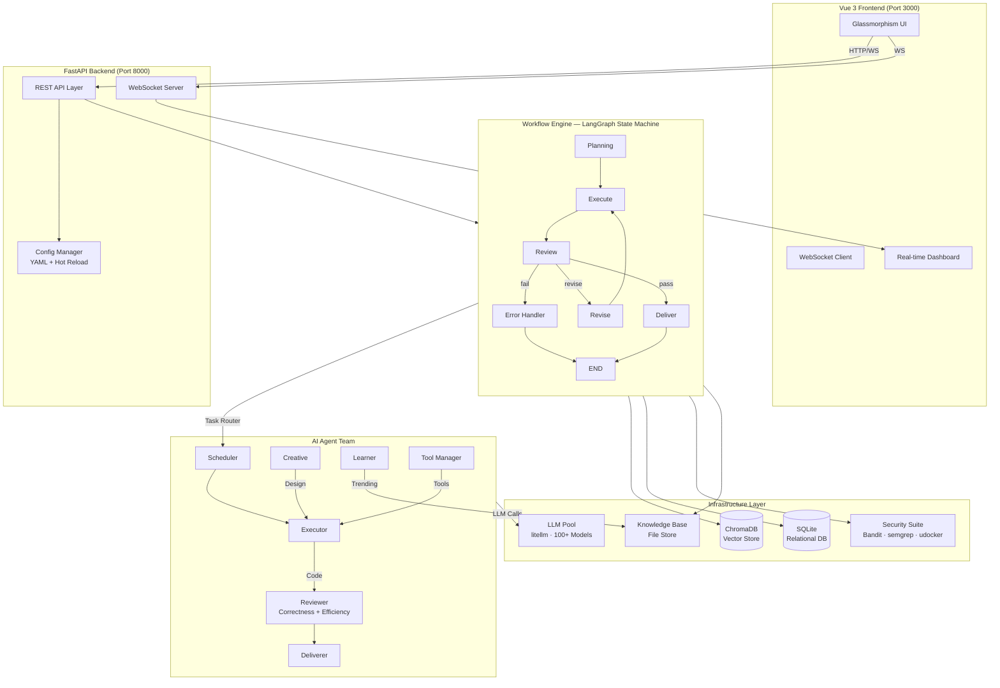

<p align="center">
  
  
  
  
  
  <br>
  
  
  
  
</p>

<h1 align="center">IReckon — Multi-Agent Autonomous Programming System</h1>
<p align="center"><em>I think it can work</em></p>

---

## Overview

**IReckon** is a production-grade **multi-agent AI system** that autonomously transforms natural language requirements into complete, reviewed, and deliverable software artifacts. It orchestrates a team of specialized AI agents through a formalized software development lifecycle — planning, coding, reviewing, revising, and delivery — with zero human intervention during execution.

Built on a **LangGraph-driven state machine** with conditional routing, loop detection, and automatic model escalation, IReckon handles the full software development pipeline within a secure, sandboxed environment.

---

## Architecture



### Agent Roles

| Role | Responsibility |
|---|---|
| **Scheduler** | Decomposes requirements into tasks, selects optimal agents for each phase |
| **Executor** | Writes, patches, debugs, and refactors code |
| **Reviewer** | Dual-review: correctness + architecture/efficiency |
| **Deliverer** | Packages artifacts, generates READY.txt, archives output |
| **Creative** | Brainstorms solutions, produces technical design proposals |
| **Learner** | Idle-time learning: crawls GitHub Trending, extracts patterns |
| **Tool Manager** | Manages tool registry, assembles custom tool pipelines |

### Workflow States

```
planning ──▶ execute ──▶ review ──┐
                ▲            │     │
                │      ┌─────┘     │
                │      ▼           ▼
                └── revise     deliver ──▶ END

                fail ──▶ handle_error ──▶ END
```

---

## Features

### Core Engine
- **Multi-agent orchestration** — 7 specialized agents with role-based prompting and tool access
- **LangGraph state machine** — Formalized DAG with conditional routing, subgraphs, and parallel execution
- **Dual-review pipeline** — Correctness (functional) + Efficiency (architectural) gates
- **Adaptive model escalation** — Automatically upgrades LLM tier after repeated revision failures
- **Task snapshot & restore** — Full state persistence for pause/resume/crash recovery

### LLM & AI Infrastructure
- **Provider-agnostic** — 100+ model support via litellm (OpenAI, Anthropic, Google, Azure, Ollama, vLLM, etc.)
- **Intelligent capability pool** — Multi-endpoint management, health checks, circuit breakers, cooldown, automatic failover
- **Streaming + fallback** — Automatic streaming degradation, exponential backoff, per-endpoint rate limiting
- **Cost tracking** — Per-task token accounting, budget enforcement, monthly quota warnings

### Security
- **Multi-layer command filtering** — L1 auto-execute / L2 consensus vote / L3 strict block
- **Static code scanning** — Bandit + semgrep integration for vulnerability detection
- **Sandboxed execution** — udocker container isolation with resource limits
- **Supply chain firewall** — pip/npm package blacklist, dependency origin validation
- **Crypto mining detection** — Process command-line pattern matching

### Frontend
- **Glassmorphism design system** — `backdrop-filter: blur(12px) saturate(180%)` with dynamic gradient backgrounds
- **Real-time WebSocket streaming** — Live task progress, log feed, and message updates
- **Multiple visual themes** — catgirl / programmer themes with customizable color schemes
- **Responsive dashboard** — System metrics, task kanban, resource monitoring

### DevOps
- **Configuration hot-reload** — YAML changes applied at runtime via watchdog
- **Idle-time self-learning** — Automatic GitHub Trending crawl during inactivity
- **Self-update system** — `self-improve` cycle: analyze → modify → PR push
- **Docker support** — Containerized deployment via docker-compose

---

## Quick Start

### Prerequisites
- Python 3.10+
- LLM endpoint (default: `http://localhost:11434` — Ollama + `qwen2.5:7b`)
- Node.js 18+

### Installation

```bash
git clone https://github.com/ninasukiwww-png/IReckon.git
cd IReckon
pip install -r requirements.txt
```

### Launch

```bash
# One-command start
python main.py

# Manual start
python -m uvicorn app.web.api:app --host 0.0.0.0 --port 8000
cd frontend && npm run dev

# Docker
docker-compose up -d
```

### Access

| Service | URL |
|---------|-----|
| Backend API | `http://localhost:8000` |
| Interactive Docs | `http://localhost:8000/docs` |
| Frontend UI | `http://localhost:3000` |
| Health Check | `http://localhost:8000/api/health` |

---

## API Reference

| Method | Path | Description |
|--------|------|-------------|
| POST | `/api/tasks` | Create a new task |
| GET | `/api/tasks` | List all tasks |
| GET | `/api/tasks/{id}` | Get task details |
| POST | `/api/tasks/{id}/cancel` | Cancel a running task |
| POST | `/api/tasks/{id}/resume` | Resume a paused/failed task |
| GET | `/api/tasks/{id}/messages` | Retrieve task messages |
| POST | `/api/tasks/{id}/messages` | Send a message to a task |
| GET | `/api/ai-instances` | List AI endpoints |
| POST | `/api/ai-instances` | Register a new AI endpoint |
| PUT | `/api/ai-instances/{id}` | Update an AI endpoint |
| DELETE | `/api/ai-instances/{id}` | Remove an AI endpoint |
| POST | `/api/ai-instances/{id}/test` | Test endpoint connectivity |
| GET | `/api/config` | Retrieve configuration |
| POST | `/api/config/update` | Update configuration at runtime |
| GET | `/api/themes` | List available UI themes |
| GET | `/api/health` | Health check endpoint |
| WS | `/ws/{task_id}` | Per-task real-time event stream |
| WS | `/ws` | Global event stream |

---

## Tech Stack

| Layer | Technology |
|-------|------------|
| Language | Python 3.10+ (asyncio) |
| LLM Interface | litellm (100+ models) |
| Workflow Engine | LangGraph |
| Vector Store | ChromaDB |
| Relational DB | SQLite (aiosqlite) |
| Backend Framework | FastAPI + WebSocket |
| Frontend Framework | Vue 3 + Vite + Pinia |
| Config Management | YAML + environment variables + watchdog |
| Logging | loguru |
| Security Scanning | Bandit, semgrep |
| Container Sandbox | udocker |
| Encryption | cryptography (Fernet) |
| Template Engine | Jinja2 |
| CI/CD | GitHub Actions |
| Packaging | PyInstaller, Buildozer |

---

## Development

```bash
# Install dependencies
pip install -r requirements.txt
cd frontend && npm install

# Code quality
ruff check app/
mypy app/
bandit -r app/

# Format
ruff format app/

# Test
python scripts/test_run.py
```

## License

Distributed under the **MIT License**. See `LICENSE` for more information.

---

<p align="center">
  <sub>Built with ❤️ by the IReckon Team</sub>
</p>
